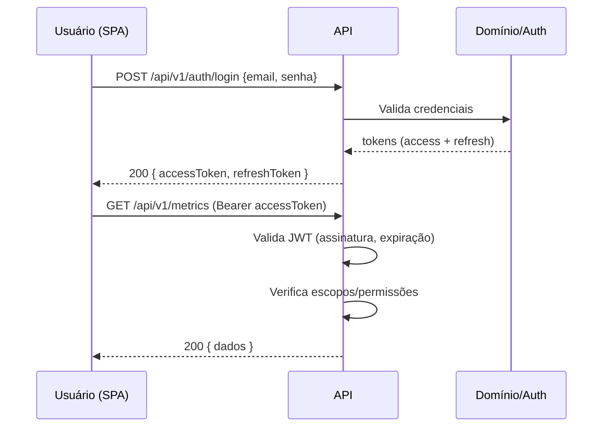

# API — Design e Contratos

> Define **como a API do CloudOps funciona**: convenções, contratos, erro, autenticação e versionamento.
> Endpoints públicos seguem **API REST** em **JSON**. Ver [ADR-0002](../decisions/0002-api-rest.md).

## 1. Princípios

- **RESTful** — recursos, verbos HTTP e códigos de status semanticamente corretos.
- **JSON** como formato de troca; `Content-Type: application/json`.
- **Versionada** — prefixo `/api/v{n}` no caminho.
- **Contrato explícito** — OpenAPI documenta todos os endpoints.
- **Sem estado** — autenticação via token (JWT) em cada requisição.
- **Erros padronizados** — mesmo formato de erro para toda a API.

## 2. Base URL e versionamento

```
https://{host}/api/v1/...
```

Regras:

- Quebra de contrato (remover/alterar campo existente) → nova versão `/api/v2`.
- Adição **aditiva** (novo campo/endpoint) não exige nova versão.
- Versões antigas são depreciadas com aviso (`Deprecation` header) antes da remoção.

## 3. Convenções de recursos

- Recursos no **plural**: `/orders`, `/products`, `/metrics`, `/integrations`.
- Identificador no caminho: `/orders/{id}`.
- Filtros via **query params** (`?period=2026-08&source=vendas`).
- Criação → `POST /recursos`.
- Leitura (lista) → `GET /recursos`.
- Leitura (um) → `GET /recursos/{id}`.
- Alteração total → `PUT /recursos/{id}`.
- Alteração parcial → `PATCH /recursos/{id}`.
- Remoção → `DELETE /recursos/{id}`.

## 4. Códigos de status HTTP

| Código | Uso |
|--------|-----|
| `200 OK` | Sucesso em leitura/atualização. |
| `201 Created` | Recurso criado. |
| `202 Accepted` | Operação assíncrona aceita (fila). |
| `204 No Content` | Remoção sem corpo. |
| `400 Bad Request` | Validação de entrada falhou. |
| `401 Unauthorized` | Autenticação ausente/Inválida. |
| `403 Forbidden` | Sem permissão para o recurso. |
| `404 Not Found` | Recurso inexistente. |
| `409 Conflict` | Conflito de estado (ex.: duplicidade/idempotência). |
| `422 Unprocessable Entity` | Entidade válida sintaticamente, mas regra de negócio violada. |
| `429 Too Many Requests` | Rate limit excedido. |
| `500 Internal Server Error` | Erro inesperado. |

## 5. Formato padronizado de erro

Toda resposta de erro segue o contrato:

```json
{
  "error": {
    "code": "RESOURCE_NOT_FOUND",
    "message": "Order not found.",
    "details": [
      { "field": "id", "message": "must be a valid uuid" }
    ],
    "requestId": "550e8400-e29b-41d4-a716-446655440000",
    "timestamp": "2026-08-30T12:00:00Z"
  }
}
```

| Campo | Descrição |
|-------|-----------|
| `code` | Código estável da categoria de erro (máquina-para-máquina). |
| `message` | Mensagem legível (localizável, PT-BR por padrão). |
| `details` | Erros de validação por campo (opcional). |
| `requestId` | Correlação com logs. |
| `timestamp` | Momento do erro (ISO 8601). |

## 6. Autenticação e autorização



Regras:

- `Authorization: Bearer <token>`.
- `accessToken` com curta duração (ex.: 15 min).
- `refreshToken` com rota própria de renovação.
- JWTs assinados com algoritmo seguro (RS256/HS256 + secret forte) via variável de ambiente.
- Autorização por **permissões/escopos**, nunca apenas por presença de token.
- 401 para token ausente/vencido; 403 para falta de permissão.

## 7. Rate limiting e idempotência

- **Rate limiting:** limites por usuário/IP (ex.: 100 req/min) → `429` com headers `X-RateLimit-*`.
- **Idempotência:** operações de criação/ingestão aceitam header `Idempotency-Key`; requisições repetidas não duplicam (ver [integrations.md](integrations.md)).

## 8. Paginação

Listagens usam paginação por cursor (estável com dados em movimento):

```
GET /api/v1/orders?limit=50&cursor=eyJpZCI6MX0
```

Resposta:

```json
{
  "data": [ ... ],
  "pagination": {
    "nextCursor": "eyJpZCI6NTE=",
    "hasMore": true
  }
}
```

## 9. Endpoints principais (referência)

> Contratos completos e atualizados são mantidos no **OpenAPI** gerado pelo backend. A lista abaixo é um resumo de referência.

| Método | Rota | Descrição |
|--------|------|-----------|
| `POST` | `/api/v1/auth/login` | Autenticação. |
| `POST` | `/api/v1/auth/refresh` | Renova token. |
| `GET` | `/api/v1/metrics` | Lista métricas agregadas. |
| `GET` | `/api/v1/metrics/:code` | Detalhe de uma métrica. |
| `GET` | `/api/v1/metrics/:code/series` | Série temporal. |
| `GET` | `/api/v1/dashboards/:id` | Composição de um dashboard. |
| `GET` | `/api/v1/orders` | Pedidos ingeridos. |
| `POST` | `/api/v1/integrations` | Cria uma integração/connector. |
| `GET` | `/api/v1/integrations/:id` | Estado de uma integração. |
| `POST` | `/api/v1/webhooks/:provider` | Entrada de webhook de fonte externa. |
| `PATCH` | `/api/v1/alert-rules/:id` | Regras de alerta. |

## 10. Autenticidade do contrato (OpenAPI)

- Contrato gerado automaticamente a partir do código (Swagger/OpenAPI).
- `docs/architecture/api.md` é a referência conceitual; o OpenAPI é a referência executável/consumível.
- Alterações de contrato devem atualizar o OpenAPI no mesmo PR.

## 11. Documentos relacionados

- [Backend](backend.md) — camada de API e seus componentes.
- [Integrações](integrations.md) — webhooks e consumo de APIs externas.
- [Segurança e Configuração](../decisions/0003-secure-config-and-secrets.md) — secrets e variáveis de ambiente.
