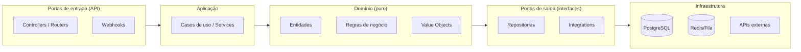

# Backend — Regras Técnicas e Arquitetura

> Referência **normativa** para o desenvolvimento do backend do CloudOps.
> **Linguagem: Python.** Todo código nesta pasta **deve** seguir estas regras — incluindo o padrão de comentários (seção 6).

## 1. Stack recomendada (Python)

| Área | Tecnologia | Justificativa |
|------|-----------|---------------|
| Linguagem | **Python 3.12+** | Legibilidade, ecossistema científico/analítico (pandas, numpy), produtividade para I.A. e dados. |
| Framework Web | **FastAPI** | Async, validação nativa com Pydantic, gera OpenAPI automaticamente, alta produtividade. |
| Validação / Schemas | **Pydantic v2** | Modelos de dados tipados; integra-se ao FastAPI. |
| ORM / Acesso a dados | **SQLAlchemy 2.x** | ORM maduro; **Alembic** para migrações. |
| Banco de dados | **PostgreSQL** | Relacional, JSONB, extensões para série temporal (TimescaleDB). |
| Fila | **Redis + RQ ou ARQ** | Filas simples e confiáveis para ingestão/processamento assíncrono. |
| Cache | **Redis** (via `redis-py`) | Cache de consultas e sessões. |
| Autenticação | **PyJWT + OAuth2 (FastAPI)** | JWT stateless, padrão. |
| Cliente HTTP | **httpx** | Async; combina com retry. |
| Testes | **pytest** | Framework padrão do ecossistema Python. |
| Lint / Formato | **ruff** | Rápido; lint + formatação em um só. |
| Tipos | **mypy** (opcional) + type hints | Clareza e manutenção. |
| Documentação API | **OpenAPI / Swagger UI** (gerado pelo FastAPI) | Contrato automático. |

> **Nota:** a stack é uma **recomendação de referência**. Trocar tecnologia exige justificativa e um ADR em `docs/decisions/`. Não adicionar dependências por conveniência (ver `AGENTS.md` §8).

## 2. Arquitetura de camadas (Hexagonal / Limpa)

O backend usa **arquitetura hexagonal** com dependência apontando para **dentro** (do núcleo em direção à infraestrutura).



**Regras de dependência:**

- `api` → `application` → `domain`.
- `application` usa `domain`; nunca o contrário.
- `infrastructure` implementa as interfaces definidas em `domain`/`application`.
- Regras de negócio (`domain`) **nunca** dependem de frameworks, HTTP, banco ou bibliotecas externas.

### 2.1 Responsabilidades de cada camada

| Camada | Pasta | Responsabilidade |
|--------|-------|------------------|
| **API** | `app/api/` | Receber requisições, validar entrada (Pydantic), mapear schemas, responder. **Sem lógica de negócio complexa**. |
| **Aplicação** | `app/application/` | Orquestrar casos de uso, transações, coordenação entre domínio e infra. |
| **Domínio** | `app/domain/` | Entidades, regras de negócio, cálculos de métricas, invariantes. Pureza total. |
| **Integrações** | `app/integrations/` | Adapters para fontes externas; normalização do dado externo para domínio. |
| **Infraestrutura** | `app/infrastructure/` | Persistência, filas, cache, clientes HTTP, config. |
| **Compartilhado** | `app/shared/` | Erros padronizados, logging, helpers, config. |

## 3. Estrutura de diretórios (normativa, Python)

```
backend/
├── pyproject.toml            # dependências, ferramentas, config do projeto
├── README.md
├── .env.example              # variáveis de ambiente de exemplo (sem secrets)
├── alembic/                  # migrações de banco
│   └── versions/
├── app/
│   ├── __init__.py
│   ├── main.py               # criação do app FastAPI e composição de DI
│   ├── config.py             # settings tipados (pydantic-settings)
│   ├── api/
│   │   ├── __init__.py
│   │   ├── dependencies.py   # deps de DI (db session, auth)
│   │   ├── routers/
│   │   │   ├── auth.py
│   │   │   ├── metrics.py
│   │   │   └── webhooks.py
│   │   ├── schemas/          # Pydantic models de entrada/saída
│   │   └── errors.py         # handlers de exceção -> HTTP padronizado
│   ├── application/
│   │   └── {feature}/
│   │       ├── use_cases.py
│   │       └── services.py
│   ├── domain/
│   │   ├── {feature}/
│   │   │   ├── entities.py
│   │   │   ├── value_objects.py
│   │   │   ├── ports.py      # interfaces (repositories, integrations)
│   │   │   └── rules.py      # cálculos/regras puras
│   │   └── shared/
│   ├── integrations/
│   │   └── {provider}/
│   │       ├── transport.py  # HTTP client, auth da fonte
│   │       ├── normalizer.py # raw -> domínio
│   │       └── provider.py   # orquestra o connector
│   ├── infrastructure/
│   │   ├── database/         # engine/session SQLAlchemy
│   │   ├── repositories/     # implementações dos ports
│   │   ├── queue/            # fila (RQ/ARQ) produtor/consumidor
│   │   ├── cache/            # wrapper Redis
│   │   └── http/             # httpx client resiliente
│   └── shared/
│       ├── errors.py         # hierarquia de exceções
│       ├── logging.py
│       └── utils.py
└── tests/                    # pytest
    ├── conftest.py
    ├── unit/
    ├── integration/
    └── e2e/
```

## 4. Regras de desenvolvimento (Python)

### 4.1 API

- `routers` usam FastAPI; recebem o caso de uso via **injeção de dependência**.
- Toda entrada passa por **Pydantic** (validação automática). **400/422** para falha.
- Erros de domínio são mapeados a respostas HTTP padronizadas (ver [api.md](api.md)).
- Endpoints versionados por prefixo: `/api/v1`.

### 4.2 Domínio

- Entidades encapsulam **invariantes**; nunca ficam em estado inválido.
- Cálculos de métricas vivem no domínio e são **puros** (função determinística).
- Persistência nunca é chamada dentro de entidade; usam-se ports/repositories.
- **Sem dependências de framework** neste pacote.

### 4.3 Aplicação (casos de uso)

- Um caso de uso = uma operação de negócio completa.
- Controla a unidade de trabalho (transação) quando necessário.
- Orquestra portas: buscar → processar → salvar → emitir eventos.
- Nome sugerido: `ImportOrderUseCase`, `RecalculateMetricUseCase`.

### 4.4 Infraestrutura

- Implementa interfaces de `domain/.../ports.py`.
- Clientes HTTP externos com **timeout**, **retry** e **circuit breaker** (ver [integrations.md](integrations.md)).
- Config via variáveis de ambiente tipadas com `pydantic-settings` (ver [ADR-0003](../decisions/0003-secure-config-and-secrets.md)).
- Nunca hardcodar URLs, chaves ou credenciais.

### 4.5 Integrações

- Cada fonte externa é um **connector** isolado em `integrations/{provider}/`.
- Normaliza o dado bruto para o **modelo neutro do domínio**.
- A falha de uma fonte **não** derruba a ingestão das demais.

## 5. Fluxo de desenvolvimento de uma feature (passo a passo)

> Dirigido ao agente que desenvolverá o código.

1. **Entenda o problema** — leia a Issue e a arquitetura existente (`docs/architecture/`).
2. **Identifique o modelo** — qual entidade/caso de uso é afetado.
3. **Defina o contrato** — schemas Pydantic de entrada/saída e endpoint (se houver).
4. **Implemente o domínio** — regras/cálculos puros primeiro, sem infraestrutura.
5. **Defina as portas** — interfaces de repositório/integração em `domain/*/ports.py`.
6. **Implemente a aplicação** — o caso de uso orquestrador.
7. **Implemente a infraestrutura** — adapter de persistência/HTTP.
8. **Exponha na API** — router + schema + injeção de dependência.
9. **Escreva os testes** — unit (domínio) > integration (app+infra) > e2e (API) com `pytest`.
10. **Execute os testes** — `pytest`; tudo deve passar.
11. **Documente** — atualize OpenAPI (automático) e changelog.

> Todo item exige testes antes de ser considerado concluído (Definition of Done).

## 6. Regras de comentários (obrigatórias)

Para **maximizar a produtividade do agente**, todo código deve ser claro e comentado:

- **Docstrings** em funções públicas, classes e módulos (formato Google/NumPy) explicando **o que faz, entradas, saídas e por quê**.
- **Comentários de intenção** para lógica não óbvia; explicar o **porquê**, não o "como" quando o código já é legível.
- **Type hints** em todas as assinaturas (parâmetros e retornos).
- Comentários em **português (PT-BR)**, seguindo a língua do projeto.

Exemplo de padrão esperado:

```python
from dataclasses import dataclass


@dataclass(frozen=True)
class Metric:
    """Métrica calculada a partir de dados operacionais."""

    code: str
    value: float
    period: str  # formato ISO-8601 do período, ex.: "2026-08"

    def as_dict(self) -> dict[str, float | str]:
        """Serializa a métrica para um dicionário (uso em schemas/respostas)."""
        return {"code": self.code, "value": self.value, "period": self.period}
```

## 7. Nomeação e convenções

- Pastas de feature em **snake_case** (ex.: `sales_overview`).
- Classes em **PascalCase** (`SalesOverviewService`).
- Funções/variáveis/módulos em **snake_case** (`calculate_ticket_medio`).
- Constantes em **UPPER_SNAKE_CASE**.
- Schemas Pydantic de entrada/saída com sufixos `Create`/`Update`/`Response` (ex.: `CreateIntegration`, `MetricResponse`).

## 8. Erros e logging

- Usar a hierarquia de exceções em `shared/errors.py`; handlers no FastAPI mapeiam para o contrato de erro (ver [api.md](api.md)).
- Log estruturado (JSON) com `request_id` em cada requisição (FastAPI middleware).
- Nunca logar secrets ou dados pessoais sensíveis.

## 9. Testes

- **Unitários**: domínio e casos de uso puros (sem I/O).
- **Integração**: infraestrutura com banco/fila reais ou de teste (SQLite/Postgres de teste + Redis de teste).
- **E2E**: caminhos críticos da API (FastAPI TestClient / httpx).
- Cobertura mínima recomendada nas regras de negócio e serviços críticos.

## 10. Documentos relacionados

- [Visão Geral](overview.md) — contexto estratégico.
- [API e Contratos](api.md) — design e convenções da API.
- [Integrações](integrations.md) — padrão de connectors.
- [Camada de Dados e Métricas](data-layer.md) — modelo e engine de métricas.
- [Infraestrutura](infrastructure.md) — execução e observabilidade.
