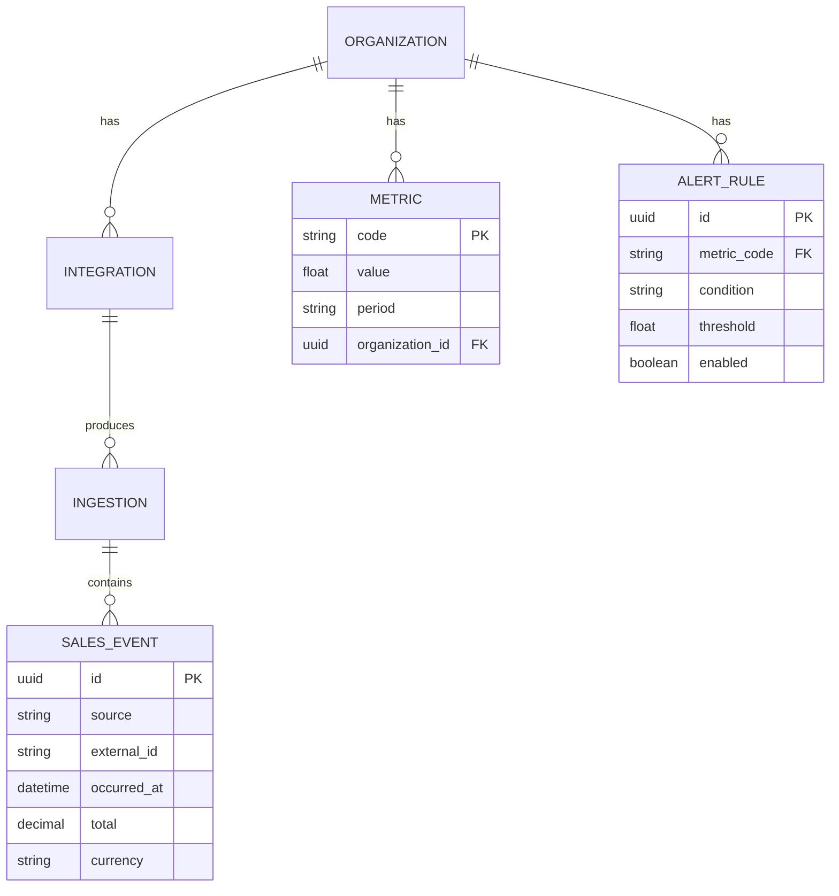
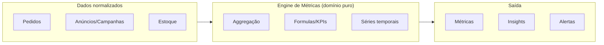

# Camada de Dados e Engine de Métricas

> Define **como os dados são modelados, armazenados e transformados em métricas, insights e alertas**.

## 1. Modelo de dados: fonte de verdade

O **PostgreSQL** é a fonte de verdade (system of record). O modelo é dividido em três grandes áreas:

1. **Configuração** — organização, usuários, integrações, regras de alerta.
2. **Dados operacionais normalizados** — pedidos, produtos, clientes, anúncios, estoque, financeiro (produzidos pelos connectors).
3. **Saída analítica** — métricas calculadas, séries temporais, snapshots de dashboards.



## 2. Eventos idempotentes de ingestão

Toda ingestão é registrada como um `INGESTION` idempotente:

- Chave de idempotência: `{source} + {external_event_id}` com **índice único**.
- Garante que reprocessamentos não duplicam dados nem métricas.
- Rejeita eventos fora do período permitido (dados futuros/profundos demais) conforme regra de negócio.

## 3. Engine de Métricas

O **Engine de Métricas** calcula KPIs a partir dos dados operacionais normalizados. É um componente **baseado em regras puras do domínio**.

### 3.1 Definição de métrica

Uma métrica é composta por:

- `code` — identificador estável (ex.: `revenue`, `orders`, `avg_ticket`, `conversion_rate`).
- `formula` — função pura `dados → valor`.
- `period` — janela de agregação (diária, semanal, mensal).
- `dimensions` — eixos de análise (fonte, produto, campanha).



### 3.2 KPIs de referência

| KPI | Código | Cálculo (exemplo) |
|-----|--------|-------------------|
| Receita | `revenue` | `sum(total)` por período. |
| Pedidos | `orders` | `count(sales_events)`. |
| Ticket médio | `avg_ticket` | `revenue / orders`. |
| Conversão | `conversion_rate` | `orders / sessions` (fonte de tráfego). |
| Custo de aquisição | `cac` | `marketing_spend / new_customers`. |

> Os KPIs exatos e suas fórmulas são decisão de negócio e serão consolidados em `docs/research/kpis.md` (roadmap).

### 3.3 Processamento

- **Sob demanda** para leitura imediata (métricas rápidas).
- **Assíncrono/agendado** para agregações pesadas via fila (ex.: recálculo diário).
- Resultados de métricas pesadas são **materializados** em tabela (snapshot) e/ou **cacheados** no Redis.
- O cálculo é **recalculável** a qualquer momento (nunca uma caixa-preta): a partir dos dados brutos pode-se reproduzir a métrica.

## 4. Séries temporais

- Séries de métricas (`history`) alimentam gráficos de tendência.
- Para volumes maiores, avaliar **TimescaleDB** (extensão do Postgres) ou colunar analítico (ex.: **ClickHouse**) — decisão futura via ADR quando o volume justificar.

## 5. Insights e Alertas

O **serviço de alertas** avalia regras (`ALERT_RULE`) contra métricas:

```python
# Exemplo conceitual (regra pura no domínio) — PSEUDOCÓDIGO
def evaluate_rule(rule, current_value) -> bool:
    """
    Avalia se uma métrica dispara uma regra de alerta.
    Retorna True quando a condição (>, >=, <, <=) é satisfeita.
    """
    if rule.condition == ">":
        return current_value > rule.threshold
    if rule.condition == "<":
        return current_value < rule.threshold
    return False
```

- Alerta disparado → notificação (e-mail / webhook de canal — configurável).
- **Sem spam**: deduplicação (um alerta por evento/período) e cooldown configurável.
- Insights são recomendações derivadas de padrões (ex.: "conversão caiu 15% vs. mesma janela anterior").

## 6. Consistência e performance

- Transações SQLAlchemy para operações multietapa.
- Índices em colunas de filtro frequentes (`organization_id`, `period`, `source`).
- Consultas pesadas de relatório podem usar materialized views.
- Cache Redis para leituras quentes; invalidação quando a fonte de dados muda.

## 7. Documentos relacionados

- [Visão Geral](overview.md) — fluxo de dados estratégico.
- [Integrações](integrations.md) — origem dos dados normalizados.
- [API](api.md) — como métricas são expostas (`/metrics`).
- [Backend](backend.md) — onde o engine de métricas vive (domínio).
