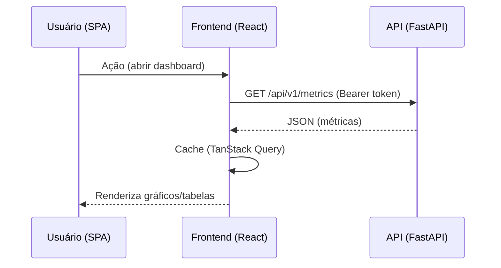

# Frontend — Arquitetura

> Define **como o dashboard do CloudOps funciona**: stack, organização, comunicação com a API e regras de desenvolvimento.

> Observação: o backend é **Python**; o frontend é uma **SPA** independente (ecossistema web — TypeScript/React), conectada à API REST. A linguagem do frontend não conflita com a do backend.

## 1. Stack recomendada

| Área | Tecnologia | Justificativa |
|------|-----------|---------------|
| Framework | **React + TypeScript** | Ecossistema maduro, tipagem, ótimo para dashboards. |
| Build | **Vite** | Setup rápido e HMR eficiente. |
| Roteamento | **React Router** | Navegação SPA. |
| Gerenciamento de estado | **TanStack Query** (server state) + **Zustand** (UI state) | Cache de API eficiente; estado local simples. |
| Gráficos | **Recharts** / **ECharts** | Visualização de métricas e séries temporais. |
| Estilo/UI | **Tailwind CSS** (ou biblioteca de componentes como **shadcn/ui**) | Produtividade e consistência. |
| Testes | **Vitest + React Testing Library** | Testes de componentes. |
| Qualidade | **ESLint + Prettier** | Padrão de código. |

## 2. Estrutura de diretórios (normativa)

```
frontend/
├── package.json
├── vite.config.ts
├── tsconfig.json
├── index.html
├── src/
│   ├── main.tsx             # bootstrap
│   ├── app/
│   │   ├── router.tsx
│   │   └── providers.tsx    # providers (query, auth)
│   ├── api/                 # client HTTP + chamadas à API
│   │   ├── client.ts
│   │   └── metrics.ts
│   ├── features/            # funcionalidades por domínio
│   │   ├── dashboard/
│   │   ├── metrics/
│   │   └── integrations/
│   ├── components/          # componentes reutilizáveis (UI)
│   ├── hooks/
│   ├── lib/                 # utils
│   └── styles/
└── tests/
```

## 3. Comunicação com a API



- **Única via de comunicação**: API REST (`/api/v1`) — ver [api.md](api.md).
- Token JWT armazenado com segurança (memória ou cookie httpOnly). **Nunca no localStorage sem avaliar risco XSS**.
- Interceptor do cliente HTTP anexa `Authorization: Bearer ...` e trata `401` (renova/redireciona para login).

## 4. Regras de desenvolvimento

- Separação em `features/` por domínio; componentes compartilhados em `components/`.
- Tipagem dos contratos da API (gerar tipos a partir do OpenAPI gerado pelo FastAPI quando possível).
- Estado de servidor via TanStack Query (cache, refetch, invalidação).
- Estado local/UI via Zustand; evitar estado global excessivo.
- Diretriz comentada: funções pequenas, nomes claros, componentes reutilizáveis.

## 5. Testes

- Componentes e hooks com Vitest + Testing Library.
- Snapshot não é regra; priorizar testes de comportamento.
- Cobrir fluxos críticos: login, listagem de métricas, renderização de gráficos, erro/empty states.

## 6. Documentos relacionados

- [API](api.md) — contratos consumidos pelo frontend.
- [Visão Geral](overview.md) — lugar do dashboard no sistema.
- [Backend](backend.md) — servidor que alimenta o frontend.
