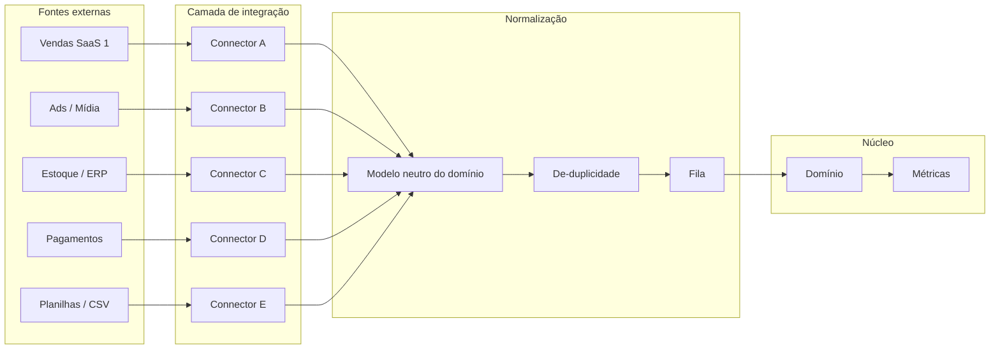
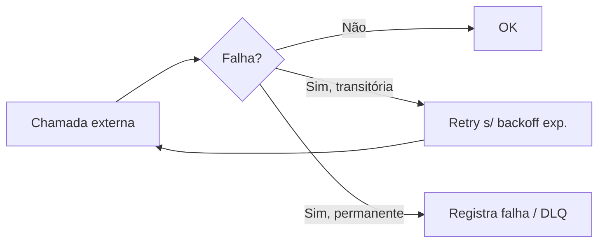

# Integrações

> Define **como o CloudOps se conecta às fontes externas** (vendas, anúncios, estoque, financeiro, planilhas), como os dados são normalizados e como a resiliência é garantida.

## 1. Visão geral

O valor central do CloudOps está em **consolidar fontes fragmentadas**. Cada fonte externa é conectada por um **connector** isolado, que converte o dado bruto da fonte para o **modelo neutro do domínio**.



## 2. Dois modos de aquisição

### 2.1 Webhook (push)

A fonte notifica o CloudOps quando há evento novo.

```
POST /api/v1/webhooks/{provider}
```

- Requisição assinada/autenticada pela fonte.
- Resposta imediata `202 Accepted`; processamento assíncrono via fila.
- **Idempotência** obrigatória: eventos com `eventId` repetido não são processados duas vezes.
- O processor confirma à fonte (ex.: `200`) para evitar reentrega eterna.

### 2.2 Polling (pull)

O CloudOps busca dados na fonte em intervalos configurados.

- `GET` na API da fonte com paginação.
- Controle de **checkpoint** (último token/timestamp processado) para retomada segura.
- Intervalos configuráveis por fonte; respeitar rate limits da fonte.

> Regra: preferir **webhook** quando a fonte oferecer; usar **polling** como fallback ou quando não houver webhook.

## 3. Padrão de connector (adapter)

Cada connector implementa duas responsabilidades:

1. **Transport** — comunicação com a fonte (HTTP client, autenticação própria, retry).
2. **Normalização** — mapeia `fonte raw → modelo neutro`.

```
integrations/{provider}/
├── transport.py       # transporte: cliente HTTP, auth da fonte, retry
├── normalizer.py      # mapeia dado bruto -> domínio
├── config.py          # config do contrato (urls, refs de credenciais)
├── test_provider.py   # testes do transporte
└── test_normalizer.py # testes da normalização
```

### Contrato de saída (modelo neutro)

Os connectors **não** persistem dados brutos no modelo do domínio. Eles produzem objetos de domínio padronizados. Exemplo de um evento de venda normalizado (Pydantic v2):

```python
from datetime import datetime
from pydantic import BaseModel
from decimal import Decimal


class SaleItem(BaseModel):
    product_id: str
    quantity: int
    unit_price: Decimal


class SalesEvent(BaseModel):
    # chave de idempotência: {source} + {external_id}
    code: str
    source: str          # ex.: "vendas-saas-1"
    occurred_at: datetime  # quando o evento aconteceu na origem
    items: list[SaleItem]
    total: Decimal
    currency: str        # ISO 4217
```

## 4. Resiliência

Fontes externas são **não confiáveis**; toda chamada deve ser protegida.

### 4.1 Timeouts

- Timeout obrigatório em **toda** chamada externa (ex.: 10s padrão).

### 4.2 Retry com backoff



- Retry apenas para falhas **transitórias** (timeout, 5xx, 429).
- **Backoff exponencial** com jitter (ex.: 1s, 2s, 4s ... máx 5 tentativas).
- Falhas permanentes (4xx) não recebem retry: registram erro.

### 4.3 Circuit breaker

- Se uma fonte está degradada, o **circuit breaker** abre e evita chamadas desnecessárias por um período.
- Estados: `closed` (normal) → `open` (parado) → `half-open` (sonda) → `closed`.
- Implementação via biblioteca **Python** de circuit breaker (ex.: `circuitbreaker`, `pybreaker`) ou `tenacity`.

### 4.4 Isolamento de falhas

- A falha de **uma fonte não afeta as demais**.
- Erros enfileirados em **Dead Letter Queue (DLQ)** para análise posterior.
- Estado da integração rastreável (`GET /api/v1/integrations/{id}`).

## 5. Idempotência e duplicidade

- Toda ingestão usa chave de idempotência: `{source} + {external_id}`.
- Índice único no banco para essas chaves evita duplicidade.
- Processamento repetido de um mesmo evento é seguro (sem duplicar métricas/pedidos).

## 6. Segredos das integrações

- Chaves/tokens de cada fonte ficam **apenas** em variáveis de ambiente / secret manager (ver [ADR-0003](../decisions/0003-secure-config-and-secrets.md)).
- **Nunca** comitar credenciais no Git.
- Rotação de credenciais suportada sem deploy (config em runtime).

## 7. Bibliotecas e ferramentas recomendadas (Python)

| Uso | Tecnologia |
|-----|------------|
| HTTP resiliente | `httpx` + `tenacity` (retry/backoff) ou `circuitbreaker`. |
| Filas | **RQ** (sobre Redis) ou **ARQ** (async). |
| Ingestão CSV/planilhas | `pandas` / `openpyxl` / `csv` padrão. |
| Agendamento de polling | `RQ` periódico (`queue.enqueue_in`) ou `APScheduler`. |
| Validação de payload externo | **Pydantic v2**. |
| Normalização / análise | `pandas`, `numpy`. |

## 8. Fluxo de adição de uma nova fonte (passo a passo)

1. **Identifique o modo** — webhook e/ou polling disponível na fonte.
2. **Defina o modelo neutro** — quais eventos/campos essa fonte mapeia.
3. **Implemente o connector** — transporte (`transport.py`).
4. **Implemente a normalização** — `normalizer.py`.
5. **Proteja com resiliência** — timeout, retry, circuit breaker.
6. **Configure a ingestão** — fila + idempotência + (se polling) agendamento/checkpoint.
7. **Exponha o webhook** — rota `/api/v1/webhooks/{provider}` com validação de assinatura.
8. **Teste** — testes do connector, normalizador e ingestão end-to-end.
9. **Documente** — contrato e changelog.

## 9. Documentos relacionados

- [API](api.md) — rota de webhooks e contratos.
- [Backend](backend.md) — camada de integração.
- [Segurança](../decisions/0003-secure-config-and-secrets.md) — secrets.

> Nota: a lista de fontes concretas a integrar (ex.: plataformas específicas de venda/ads) será definida em `docs/research/` conforme o roadmap do negócio.
