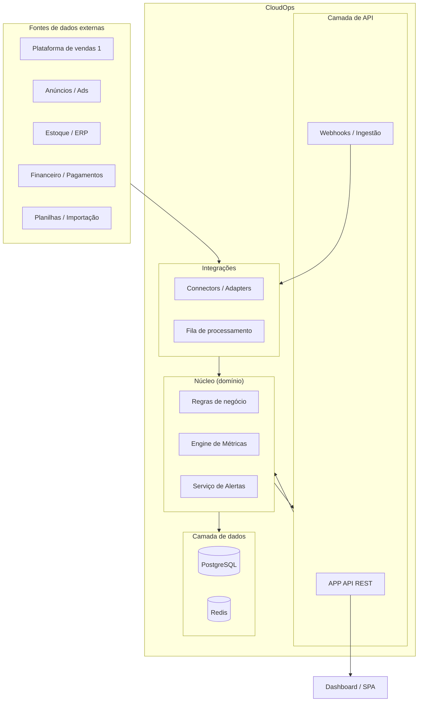
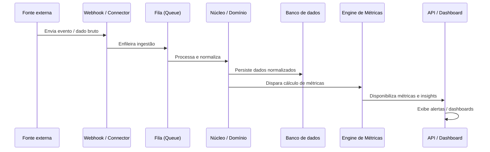

# Visão Geral da Arquitetura

> Documento estratégico de referência para o CloudOps.
> Status: **Proposta de Arquitetura** — define a direção e as regras técnicas do sistema.

## 1. Propósito

O CloudOps é uma **plataforma de inteligência operacional (B.I.)** para operadores de e-commerce e negócios digitais.

O problema resolvido:

- Dados dispersos em várias fontes (vendas, anúncios, estoque, financeiro, planilhas).
- Operação fragmentada e difícil de acompanhar.
- Decisões baseadas em informações incompletas.

O valor entregue:

- **Centralizar** a visão da operação em um único lugar.
- **Normalizar** dados heterogêneos em um modelo comum.
- **Calcular** métricas, insights e alertas.
- **Apresentar** informações acionáveis a gestores.

## 2. Princípios estratégicos

Os seguintes princípios guiam todas as decisões técnicas:

| # | Princípio | Descrição |
|---|-----------|-----------|
| 1 | Simplicidade | Usar a solução mais simples que resolve o problema atual. |
| 2 | Modularidade | Código dividido por responsabilidade; camadas separadas. |
| 3 | Domínio independente | Regras de negócio sem dependência de frameworks. |
| 4 | Contratos explícitos | APIs e integrações com contratos versionados. |
| 5 | Resiliência | Integrações externas tratadas como não confiáveis. |
| 6 | Observabilidade | Tudo que acontece deve ser mensurável/logável. |
| 7 | Segurança por padrão | Secrets nunca no código; entradas sempre validadas. |
| 8 | Evolução incremental | Monólito modular primeiro; microserviços só quando justificado. |

> **Decisão estratégica:** começar como **monólito modular** e evoluir de forma incremental. Ver [ADR-0001](../decisions/0001-modular-monolith.md).

## 3. Visão em camadas



## 4. Fluxo de dados principal



## 5. Mapa de componentes (estado-alvo)

```
backend/
├── pyproject.toml
├── README.md
├── .env.example
├── alembic/
│   └── versions/          # migrações de banco
├── app/
│   ├── __init__.py
│   ├── main.py            # app FastAPI + composição de DI
│   ├── config.py          # settings tipados (pydantic-settings)
│   ├── api/               # routers, schemas, validação, auth
│   ├── application/       # casos de uso / serviços de aplicação
│   ├── domain/            # entidades, regras de negócio, value objects
│   ├── integrations/      # connectors de fontes externas
│   ├── infrastructure/    # persistência, filas, cache, clientes HTTP
│   └── shared/            # utilidades comuns (erros, logging, config)
└── tests/                 # pytest
```

> A estrutura detalhada e as regras de cada camada estão em [backend.md](backend.md).

## 6. Decisões estratégicas registradas

| Código | Título | Status |
|--------|--------|--------|
| [ADR-0001](../decisions/0001-modular-monolith.md) | Monólito modular como estratégia inicial | Proposta |
| [ADR-0002](../decisions/0002-api-rest.md) | API REST versionada como contrato público | Proposta |
| [ADR-0003](../decisions/0003-secure-config-and-secrets.md) | Configuração e secrets fora do código | Proposta |
| [ADR-0004](../decisions/0004-python-backend.md) | Python como linguagem do backend | Proposta |

## 7. Documentos relacionados

- [Backend](backend.md) — regras técnicas do backend.
- [API e Contratos](api.md) — design da API.
- [Integrações](integrations.md) — como as fontes externas são conectadas.
- [Camada de Dados e Métricas](data-layer.md) — modelo de dados e engine de métricas.
- [Frontend](frontend.md) — arquitetura do dashboard.
- [Infraestrutura](infrastructure.md) — implantação, CI/CD e observabilidade.
- [Regras de Engenharia](../../AGENTS.md) — regras gerais de desenvolvimento.
